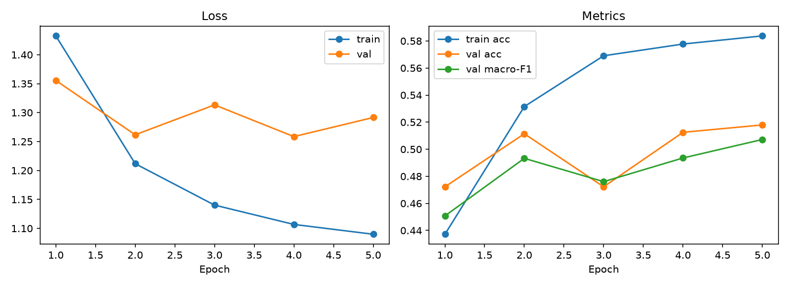

# Wildlife Camera-Trap Classification

An end-to-end machine learning engineering MVP for six-class wildlife camera-trap image classification using an ImageNet-pretrained ResNet18.

The project covers the complete baseline workflow from annotation processing and reproducible dataset construction to image-integrity validation, PyTorch training, validation metrics, checkpointing, automated tests, and experiment artifacts.

## Project Status

**MVP v0.1 completed: reproducible ResNet18 head-only transfer-learning baseline**

Current baseline:

- 6 camera-trap classes
- 6,000 selected images
- fixed train, validation, and test splits
- ImageNet-pretrained ResNet18
- frozen convolutional backbone
- trainable six-class classification head
- full train/validation pipeline
- checkpointing and training artifacts
- automated data-integrity checks
- 80 passing tests
- test set preserved for future final evaluation

## Problem

Camera-trap projects can generate very large collections of images, many of which are empty or contain animals that are difficult to identify because of:

- nighttime illumination
- motion blur
- partial occlusion
- small animals
- background clutter
- changing camera locations
- visually similar species

Manually reviewing these images is slow and difficult to scale.

This project builds a reproducible machine learning pipeline for classifying camera-trap images into six categories:

| Class index | Class name |
|---:|---|
| 0 | `empty` |
| 1 | `deer` |
| 2 | `coyote` |
| 3 | `bobcat` |
| 4 | `bird` |
| 5 | `opossum` |

## MVP Objectives

The first project milestone focuses on establishing a trustworthy baseline rather than designing a new neural-network architecture.

The MVP verifies that the following pipeline works end to end:

```text
Raw annotations
    ↓
Structured metadata
    ↓
Reproducible six-class subset
    ↓
Fixed train / validation / test splits
    ↓
Image download and integrity validation
    ↓
PyTorch Dataset and DataLoader
    ↓
ImageNet-pretrained ResNet18
    ↓
Training and validation
    ↓
Metrics, checkpoints, and experiment artifacts
```

## Dataset

The project uses the **Caltech Camera Traps** dataset distributed through the LILA wildlife dataset platform.

Raw images and the original annotation JSON are not committed to this repository. They must be obtained from the official dataset source and remain subject to the dataset's original terms of use.

### Selected MVP subset

The MVP contains:

| Split | Images |
|---|---:|
| Train | 4,156 |
| Validation | 919 |
| Test | 925 |
| **Total** | **6,000** |

The subset contains 1,000 images from each of the six target classes.

The selection process samples at most one image from each sequence to reduce near-duplicate consecutive frames and improve the diversity of the MVP dataset.

Fixed split manifests are stored under:

```text
data/processed/splits/
├── train.csv
├── val.csv
├── test.csv
└── split_summary.json
```

The test split has not yet been used for model evaluation. It is reserved for final evaluation after model development and selection are complete.

## Data Integrity

A complete image-integrity workflow is included in the project.

Every image referenced by the train, validation, and test manifests is checked using both:

1. `PIL.Image.verify()`
2. a fresh full decode using `Image.load()`

The integrity checker detects:

- missing images
- zero-byte files
- truncated JPEGs
- corrupted image files
- images that open successfully but fail during full decoding

During development, the complete scan found two truncated JPEG files. Both were selectively re-downloaded from the official source and validated before replacing the damaged local files.

Final integrity result:

| Check | Result |
|---|---:|
| Unique referenced images checked | 6,000 |
| Valid images | 6,000 |
| Missing images | 0 |
| Corrupt or truncated images | 0 |
| Repaired images | 2 |

The final report is stored at:

```text
artifacts/data_checks/caltech_image_integrity.json
```

## Model

The baseline uses an ImageNet-pretrained **ResNet18** from `torchvision`.

The original ImageNet classification layer is replaced with a six-class linear layer:

```python
model.fc = torch.nn.Linear(512, 6)
```

The model returns raw logits. Softmax is not manually applied before calculating the loss.

### Transfer-learning strategy

For the first baseline:

- the pretrained ResNet18 backbone is frozen
- only the new classification head is trained
- no novel architecture is introduced

Parameter counts:

| Parameter group | Count |
|---|---:|
| Total parameters | 11,179,590 |
| Trainable parameters | 3,078 |
| Trainable percentage | 0.0275% |

The trainable parameters are:

```text
fc.weight
fc.bias
```

This configuration provides a fast and reproducible baseline while preserving the visual features learned from ImageNet.

## Training Configuration

| Setting | Value |
|---|---|
| Model | ResNet18 |
| Pretrained weights | ImageNet |
| Backbone | Frozen |
| Output classes | 6 |
| Image size | 224 × 224 |
| Epochs | 5 |
| Batch size | 16 |
| Optimizer | AdamW |
| Learning rate | 0.001 |
| Weight decay | 0.0001 |
| Loss function | CrossEntropyLoss |
| Random seed | 42 |
| Best-model criterion | Validation macro-F1 |
| Training device | CPU |

## Baseline Results

The head-only baseline was trained on the complete training split and evaluated on the complete validation split.

| Model | Training strategy | Train accuracy | Validation accuracy | Validation macro-F1 |
|---|---|---:|---:|---:|
| ResNet18 | ImageNet pretrained, frozen backbone | 58.37% | 51.80% | 50.72% |

Final losses:

| Metric | Value |
|---|---:|
| Train loss | 1.0898 |
| Validation loss | 1.2916 |

The best checkpoint was selected using validation macro-F1.

The validation results are substantially above six-class random prediction, but they should be interpreted as a first engineering baseline rather than final model performance.

### Training curves



The curves show:

- steadily decreasing training loss
- steadily increasing training accuracy
- improving validation accuracy and macro-F1 overall
- some validation-loss fluctuation
- a moderate train-validation gap
- diminishing improvement during later head-only epochs

These results suggest that the frozen classification head is learning meaningful information, while further progress will likely require controlled backbone fine-tuning and deeper error analysis.

## Repository Structure

```text
wildlife-camera-trap-classification/
├── artifacts/
│   ├── data_checks/
│   │   ├── caltech_image_integrity.json
│   │   └── dataloader_summary.json
│   └── training/
│       └── resnet18_head_retry1/
│           ├── history.json
│           ├── run_summary.json
│           └── training_curves.png
│
├── configs/
│
├── data/
│   ├── metadata/
│   │   ├── caltech_mvp_subset.csv
│   │   └── caltech_mvp_subset_summary.json
│   ├── processed/
│   │   └── splits/
│   │       ├── train.csv
│   │       ├── val.csv
│   │       ├── test.csv
│   │       └── split_summary.json
│   └── raw/
│       └── .gitkeep
│
├── notebooks/
│
├── src/
│   ├── data/
│   │   ├── build_caltech_metadata.py
│   │   ├── caltech_dataset.py
│   │   ├── caltech_dataloaders.py
│   │   ├── download_caltech_subset.py
│   │   ├── inspect_caltech_annotations.py
│   │   ├── inspect_caltech_dataloader.py
│   │   ├── select_caltech_mvp_subset.py
│   │   ├── split_caltech_mvp.py
│   │   ├── validate_caltech_images.py
│   │   └── validate_caltech_mvp_subset.py
│   │
│   ├── models/
│   │   └── resnet18_classifier.py
│   │
│   └── training/
│       └── train_resnet18.py
│
├── tests/
├── .gitignore
├── pyproject.toml
├── requirements.txt
└── README.md
```

## Setup

The project was developed with:

- Windows PowerShell
- Python 3.11
- PyTorch 2.13 CPU build
- Torchvision 0.28 CPU build

### 1. Clone the repository

```powershell
git clone https://github.com/Lostseeking/wildlife-camera-trap-classification.git
cd wildlife-camera-trap-classification
```

### 2. Create a virtual environment

```powershell
python -m venv .venv
.\.venv\Scripts\Activate.ps1
```

### 3. Install dependencies

```powershell
python -m pip install -r requirements.txt
```

Raw images are not included in the repository.

## Data Pipeline

The project separates data preparation into small, testable modules.

### Main stages

1. Inspect the original Caltech annotation JSON.
2. Build image-level metadata.
3. Select the six-class MVP subset.
4. Validate the selected manifest.
5. Download the referenced images.
6. Create fixed train, validation, and test splits.
7. Validate every referenced image.
8. Build PyTorch datasets and data loaders.

The command-line options for each stage can be inspected with:

```powershell
python -m src.data.build_caltech_metadata --help
python -m src.data.select_caltech_mvp_subset --help
python -m src.data.download_caltech_subset --help
python -m src.data.split_caltech_mvp --help
python -m src.data.validate_caltech_images --help
```

### Check image integrity

Check without modifying files:

```powershell
.\.venv\Scripts\python.exe -m src.data.validate_caltech_images --check-only
```

Repair only missing or invalid referenced images:

```powershell
.\.venv\Scripts\python.exe -m src.data.validate_caltech_images --repair
```

Repair mode does not re-download valid images.

## Training

### Smoke test

Before full training, run a limited smoke test:

```powershell
.\.venv\Scripts\python.exe -m src.training.train_resnet18 --epochs 1 --batch-size 8 --max-train-batches 5 --max-val-batches 2 --run-name resnet18_smoke
```

The smoke test verifies:

- model construction
- pretrained-weight loading
- output shape
- finite loss
- backward propagation
- finite gradients
- optimizer updates
- unchanged frozen parameters
- validation execution
- metric generation
- checkpoint creation
- history and summary generation
- training-curve generation

Smoke-test metrics are not final model-performance estimates because only a small number of batches are processed.

### Full head-only baseline

```powershell
.\.venv\Scripts\python.exe -m src.training.train_resnet18 --epochs 5 --batch-size 16 --num-workers 0 --learning-rate 0.001 --weight-decay 0.0001 --run-name resnet18_head_retry1 --log-interval 25
```

The full baseline uses all training and validation batches.

It does not evaluate the test split.

## Training Artifacts

Each training run generates:

```text
artifacts/training/<run_name>/
├── history.json
├── run_summary.json
└── training_curves.png
```

Checkpoints are generated locally under:

```text
artifacts/checkpoints/
```

Checkpoint files are excluded from Git because they can be regenerated and may become large.

### Checkpoint types

- `*_best.pt`: model with the best validation macro-F1
- `*_last.pt`: model from the final completed epoch

## Metrics

The validation pipeline calculates:

- sample-weighted loss
- accuracy
- six-class confusion matrix
- per-class precision
- per-class recall
- per-class F1
- macro-F1

Macro-F1 is used for model selection because it gives equal weight to every class, rather than allowing a common or easier class to dominate the evaluation.

Zero denominators are handled safely using a zero-value policy.

## Testing and Code Quality

Run the full test suite:

```powershell
.\.venv\Scripts\python.exe -m pytest
```

Run Ruff:

```powershell
.\.venv\Scripts\ruff.exe check src tests
```

Run Mypy:

```powershell
.\.venv\Scripts\mypy.exe src
```

Current validation status:

| Check | Result |
|---|---|
| Pytest | 80 passed |
| Ruff | Passed |
| Mypy | Passed |

The tests use generated temporary images and small CSV files. They do not require the complete 6,000-image dataset or network access.

## Reproducibility and Engineering Decisions

The project includes several safeguards intended to make experiments reproducible and trustworthy:

- fixed class ordering
- fixed split CSV files
- random seed recorded in artifacts and checkpoints
- raw logits passed directly to `CrossEntropyLoss`
- only trainable parameters passed to the optimizer
- gradient and parameter-change checks
- frozen-backbone integrity checks
- NaN and Inf validation
- atomic or safe file replacement during image repair
- best and last checkpoints stored separately
- test split kept untouched during baseline development
- configuration and library versions stored in run summaries

Complete bitwise determinism is not guaranteed across different hardware, operating systems, and PyTorch builds.

## Current Limitations

The current release is intentionally limited to a first baseline.

It does not yet include:

- backbone fine-tuning
- learning-rate scheduling
- class-weighted loss
- balanced sampling
- advanced data augmentation
- detailed confusion-matrix visualization
- systematic error analysis
- nighttime versus daytime analysis
- camera-location domain-shift analysis
- single-image inference
- REST API or web deployment
- active learning
- production monitoring
- final test-set evaluation

The current validation metrics should therefore not be interpreted as the final performance ceiling of the project.

## Roadmap

Planned next milestones include:

1. Analyze per-class errors and the confusion matrix.
2. Inspect difficult nighttime, occluded, and small-animal examples.
3. Fine-tune selected later ResNet18 layers.
4. Compare head-only training with partial and full fine-tuning.
5. Evaluate class weighting or balanced sampling.
6. Introduce controlled camera-trap-specific augmentation.
7. Add single-image inference.
8. Perform final test-set evaluation after model selection.
9. Add active-learning support for prioritizing uncertain images.
10. Add deployment and monitoring components.

## Key Engineering Takeaway

This project is not only a model-training script.

It is a reproducible machine learning pipeline that includes:

- deterministic data preparation
- data-quality validation and repair
- modular PyTorch components
- transfer learning
- smoke testing
- experiment tracking
- checkpointing
- automated testing
- static analysis
- explicit separation of train, validation, and test responsibilities

The baseline establishes a stable reference point against which future improvements can be measured.

## Acknowledgements

- Caltech Camera Traps dataset
- LILA wildlife dataset platform
- PyTorch and Torchvision
- ImageNet-pretrained ResNet18 weights

Dataset files and pretrained weights remain subject to their respective original licenses and terms of use.